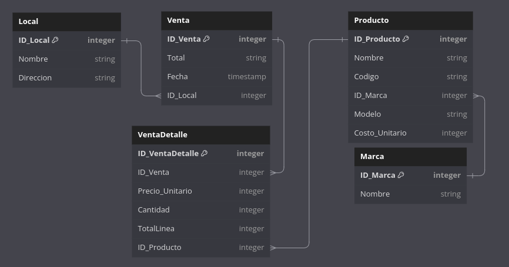

## Back defontana

El siguiente repositiorio contiene la solucion a ls preguntas realizadas.

El back fue construirdo en python y docker por lo cual si desea ejecutarlo ejecute los comandos:

```bash
docker build -t defontana_back .  
docker run --name backDefontana -p 5000:5000 defontana_back:latest 
```

por fines de lograr el reto y entender la base de datos se ha realizado un diagrama actualizado segun lo encontrado en la base de datos:



adicionalmente para complir con la segunda parte acontinuacion encontrara los sql para cada seccion:


• El total de ventas de los últimos 30 días (monto total y cantidad total de ventas).
```sql
SELECT 
    COUNT(*) as total_ventas, 
    SUM(Total) as monto_total_ventas
FROM 
    Prueba.dbo.Venta
WHERE 
    Fecha >= DATEADD(dd, -30, GETDATE()) 
    AND Fecha < GETDATE();
```
• El día y hora en que se realizó la venta con el monto más alto (y cuál es aquel monto).
```sql
SELECT TOP 1 Fecha, Total
FROM Prueba.dbo.Venta
ORDER BY Total DESC;
```
• Indicar cuál es el producto con mayor monto total de ventas. El total de ventas de un producto
se encuentra en la tabla VentaDetalle columna TotalLinea.
```sql
SELECT TOP 1 p.*, SUM(vd.TotalLinea) as monto_total_ventas
FROM Prueba.dbo.Producto p
JOIN Prueba.dbo.VentaDetalle vd ON p.ID_Producto = vd.ID_Producto
GROUP BY p.ID_Producto, p.Nombre, p.Codigo, p.ID_Marca, p.Modelo, p.Costo_Unitario
ORDER BY monto_total_ventas DESC;
```
• Indicar el local con mayor monto de ventas.
```sql
SELECT TOP 1 l.*, SUM(v.Total) as monto_total_ventas
FROM Prueba.dbo.Local l
JOIN Prueba.dbo.Venta v ON l.ID_Local = v.ID_Local
GROUP BY l.ID_Local, l.Nombre, l.Direccion
ORDER BY monto_total_ventas DESC;
```
• ¿Cuál es la marca con mayor margen de ganancias? El margen de ganancias de un producto
está dado por (Cantidad vendida * Precio unitario) - (Cantidad vendida * Costo).
```sql
SELECT TOP 1 m.*, SUM((vd.Cantidad * vd.Precio_Unitario) - (vd.Cantidad * p.Costo_Unitario)) as margen_ganancias
FROM Prueba.dbo.Marca m
JOIN Prueba.dbo.Producto p ON m.ID_Marca = p.ID_Marca
JOIN Prueba.dbo.VentaDetalle vd ON p.ID_Producto = vd.ID_Producto
GROUP BY m.ID_Marca, m.Nombre
ORDER BY margen_ganancias DESC;

```
• ¿Cómo obtendrías cuál es el producto que más se vende en cada local?
```sql
WITH VentasPorLocal AS (
    SELECT v.ID_Local, vd.ID_Producto, SUM(vd.Cantidad) as total_vendido
    FROM Prueba.dbo.Venta v
    JOIN Prueba.dbo.VentaDetalle vd ON v.ID_Venta = vd.ID_Venta
    GROUP BY v.ID_Local, vd.ID_Producto
)
SELECT l.*, p.*, vp.total_vendido
FROM Prueba.dbo.Local l
JOIN VentasPorLocal vp ON l.ID_Local = vp.ID_Local
JOIN Prueba.dbo.Producto p ON vp.ID_Producto = p.ID_Producto
WHERE vp.total_vendido = (
    SELECT MAX(total_vendido)
    FROM VentasPorLocal
    WHERE ID_Local = l.ID_Local
);
```